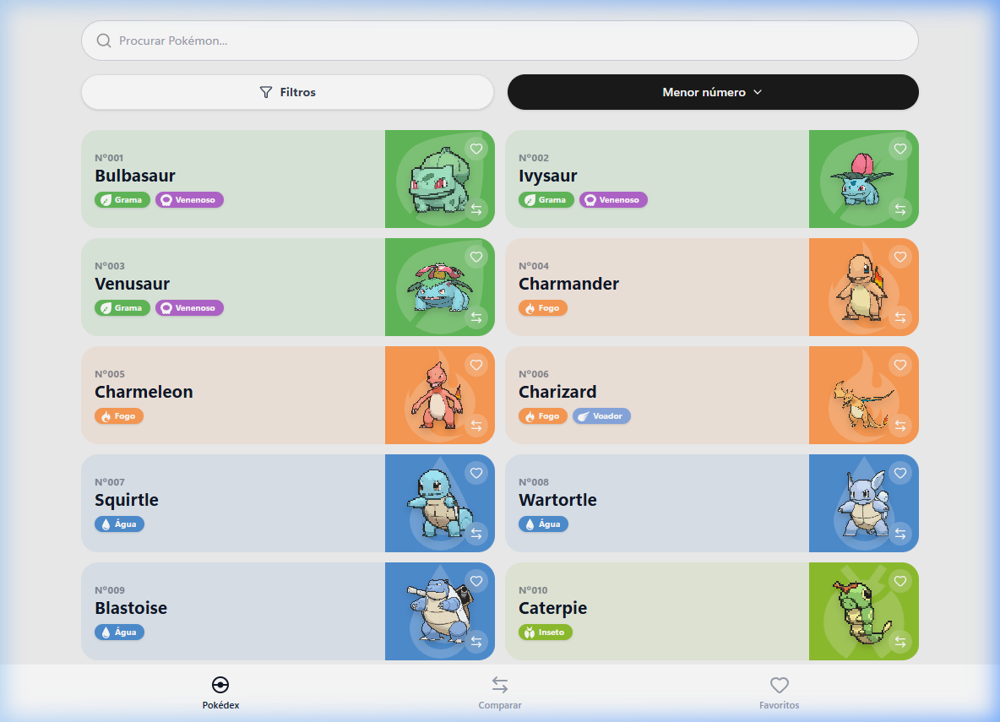
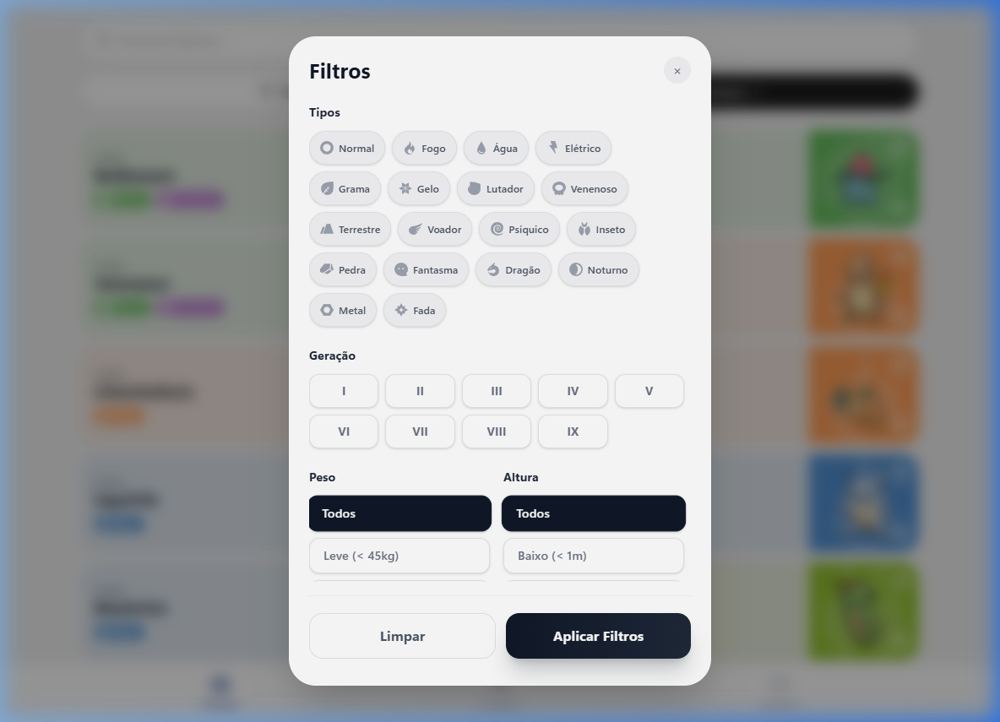
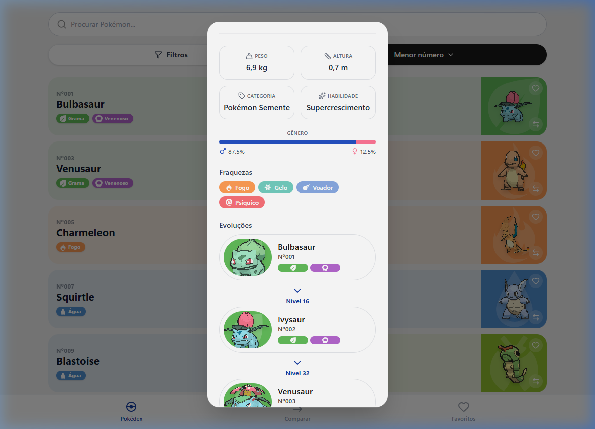
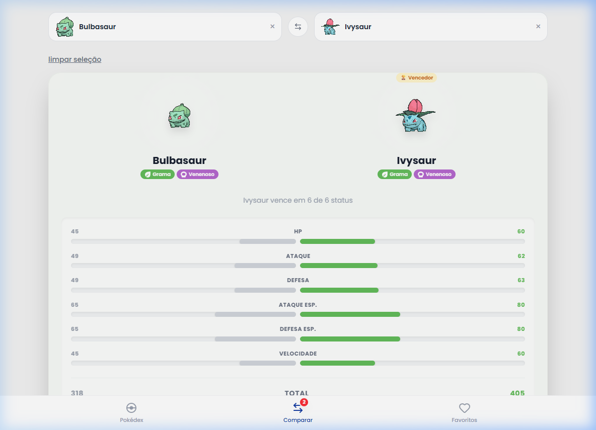

<div align="center">
  
  <h1>Pokédex - Teste Técnico Leany</h1>
</div>

<br/>


**🚀 Deploy Oficial:** [pokedex-teste-leany.vercel.app](https://pokedex-teste-leany.vercel.app)

Uma Pokédex responsiva e interativa desenvolvida como resolução do desafio técnico para desenvolvedor Frontend na Leany. A aplicação consome a [PokeAPI](https://pokeapi.co/) para exibir uma listagem infinita de Pokémons, detalhes, evoluções e funcionalidades avançadas como filtros compostos e comparador de status.

Desenvolvido por [Felipe Urbanek](https://felipeurbanek.com).

## 📸 Preview

| Tela Inicial | Filtros |
|:---:|:---:|
|  |  |

| Detalhes & Evolução | Comparador de Status |
|:---:|:---:|
|  |  |

## 🚀 Como rodar localmente

Certifique-se de ter o Node.js instalado (v18+ recomendado).

1. Clone o repositório:
```bash
git clone https://github.com/FelipeUrbanek/Pok-dex---Teste-Leany.git
```

2. Instale as dependências:
```bash
npm install
```

3. Inicie o servidor local:
```bash
npm run dev
```

## ✨ Funcionalidades

Abaixo as entregas principais de acordo com os requisitos do case:

- **Listagem e Busca Infinita**: Carregamento sob demanda (infinite scroll) consumindo a REST API. A busca por nome é feita localmente num cache em memória para resposta instantânea.
- **Filtros Avançados (GraphQL)**: Para resolver o problema de filtrar dados complexos sem baixar toda a base da PokeAPI, integrei a API GraphQL Beta oficial deles. Assim, é possível cruzar "Tipo", "Altura", "Peso" e "Geração" com alta performance, repassando os IDs paginados para a listagem principal.
- **Favoritos Persistentes**: Salve Pokémons em sua lista pessoal utilizando o `Zustand`, persistido nativamente no `localStorage`.
- **Comparador de Status**: Escolha dois Pokémons da listagem ou favoritos e compare lado a lado seus atributos (HP, Ataque, Defesa, etc.). As barras de atributos se adaptam dinamicamente baseando-se no maior valor do par.
- **Detalhes Completos & Cadeia Evolutiva**: Modelagem recursiva das cadeias de evolução, renderizando as miniaturas na ordem de crescimento, junto às descrições e atributos corporais.
- **Tradução em Lote**: A API não possui dados totalmente traduzidos das gerações mais antigas. Criei um utilitário local em TypeScript mapeando chaves de descrições e categorias (ex: "Seed Pokémon" para "Pokémon Semente") a fim de entregar uma experiência 100% em PT-BR para o usuário brasileiro.
- **Micro-interações**: Uso pesado de GSAP para animações fluídas (como os saltinhos na capa do Pokémon, abertura de modais com Blur-in e preenchimento de barras de status).

## 📁 Arquitetura do Projeto

O projeto segue um padrão voltado para manutenção e separação de responsabilidades (Clean Code / SOLID):
- `/src/api` - Comunicação com APIs (Fetch, chamadas REST/GraphQL).
- `/src/components` - Componentes atômicos e blocos da interface.
- `/src/hooks` - Hooks dedicados (usando React Query) que isolam toda regra de chamadas HTTP dos componentes visuais.
- `/src/pages` - Telas de navegação da aplicação.
- `/src/store` - Estado global focado (filtros, favoritos, status do comparador).
- `/src/utils` - Utilitários puros (mapeadores de dados, conversores de cores tipológicas, formatadores numéricos).
